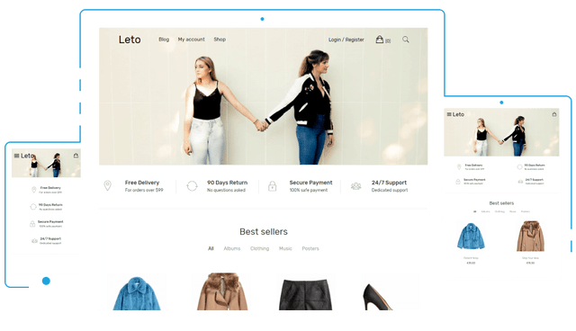
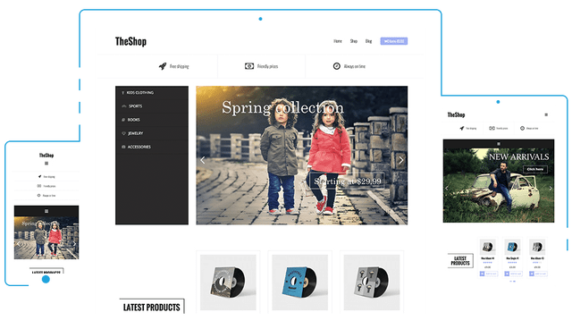
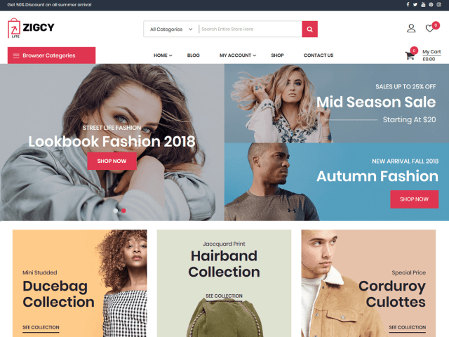

**LETO**  

Leto is a modern theme. The Leto theme is used with WooCommerce, making it excellent for any store. You may have the opportunity to place a video that explains your product or company to the front page. You can change colors, typography, and so on.  
This is a simple but stunning topic for small and large eCommerce businesses. It does not matter if you sell a physical product or service, because the theme is completely done for that. There is no need to limit yourself and worry about specific colors as you can adjust.  
[Download](https://athemes.com/theme/leto/ "Title")

**TheShop**  
  
TheShop is a wonderful eCommerce theme, designed to help you sell more. The stylish, minimalist design makes it a perfect theme to display your products and to have more sales.  
TheShop is also known for an impressive range of personalization options and design styles.  
[Download](https://athemes.com/theme/theshop/ "Title")

**Zigcy Lite**  
  
With Zigcy Lite you can not only customize your colors and fonts, but you can also create a beautiful page that shows your best and most popular products.  
The theme has a deep integration with WooCommerce so you'll benefit from features such as the ability to search for products and content, a call-to-action section inviting visitors to watch the latest products, and so on. The theme is fully responsive to mobile devices and comes with a wonderful slider which is perfect for promoting your products. The theme is easy to use and fast to load.  
[Download](https://accesspressthemes.com/wordpress-themes/zigcy-lite/ "Title")

