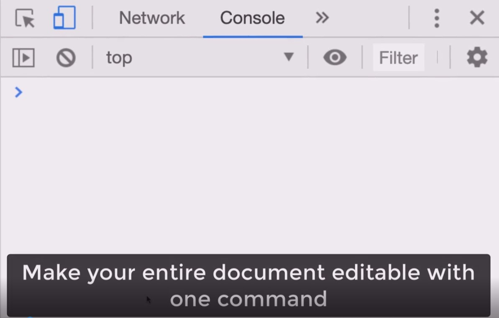

I am sure that all of you will find this trick useful when they are making a web application or just they to test something on the website they are currently developing. Just open Chrome DevTools and write in console:
´´´document.designMode = 'on'´´´

