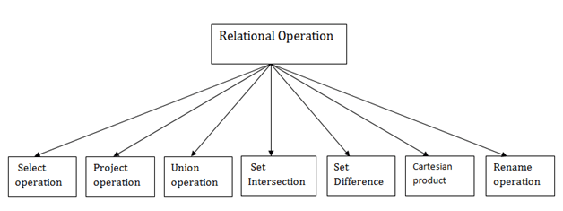

When working with the relational model, we have 2 groups of operations we can use.

**The first is called relational algebra, and it’s a procedural language.**

This is what SQL is based upon, and as such it is very important to learn - as SQL is the de-facto standard for working with relational databases.

The second is called relational calculus and instead of being procedural, it’s a declarative language. It’s a fundamental difference in how we interact with databases, because you don’t tell the database software what to do, you just tell it what you want, and let it sort out the details of how to do it.

This is a common distinction among programming languages. In modern frontend, we say interaction with the DOM in React is declarative. Using vanilla JavaScript to modify the DOM is procedural.

Languages like Datalog, QBE and QUEL have relational calculus as its base. I’m not going to talk about this because I think it’s a much more niche way of doing things compared to the more practical approach followed by SQL, but you can look at it if you want.

Given this introduction, let’s go on with relational algebra.

**We have 2 types of operations:**

 + primary operations
 + join operations

**Primary operations in relational algebra**

 + union to get data from two tables, generating a sum of the tuples, as long as the two tables have the same columns and attribute types (domain).
 + difference to get data contained in the first table but not in the second table, generating a difference of the tuples, as long as the two tables have the same columns and attribute types (domain).
 + cartesian product to get data from two tables into and generate one single table that combines the data of them, based on an attribute value.
 + select to only extract some of the tuples (rows) contained in a table based on certain criteria.
 + project to generate a new table containing only one or more attributes (columns) of an existing table
 + rename used to rename an attribute, used to prevent conflicts when multiple tables have the same name for different data

**Join operations in relational algebra**

Joins are probably the most powerful operations you can perform with relational algebra. They build on top of primary operations, and they allow you to correlate data contained in different relations (tables).

Note: I’ll soon talk about joins in practice in a DBMS, this is mostly theory.

We have 2 main join versions: natural join and theta join. All the other versions are extracted from those 2.

**Natural Join**

Natural join correlates two relations (tables), and creates a new table based on the same values of an attribute.

We need two relations with the same attribute name (column), first. Then if values in the attributes in relation A are unmatched in the attributes in relation B, the row is not part of the result, it’s ignored.

**Theta-join**

A theta-join allows to perform a join based on any criteria to compare two columns in two different relations, not just equality like the natural join does.

It performs a cartesian product of two tables, and filters the results based on the selection we want to make.

**Equi-join**

The equi-join is a theta join, where the selection is based on equality between attribute values in the two different tables.

The difference with the natural join is that we can choose which attributes names (columns) we want to compare.