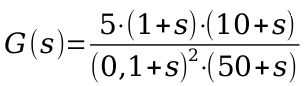
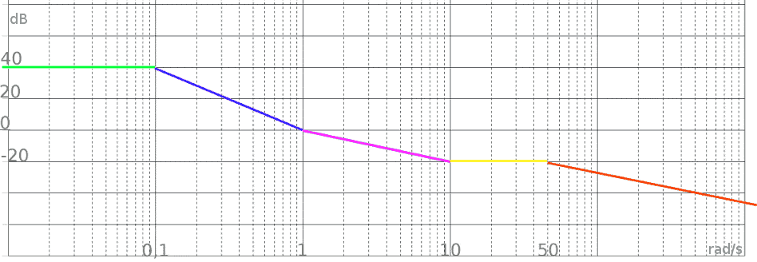
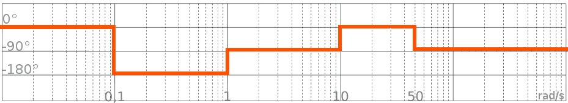
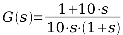
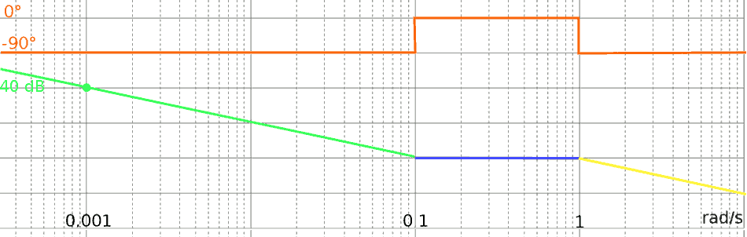
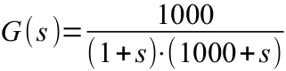
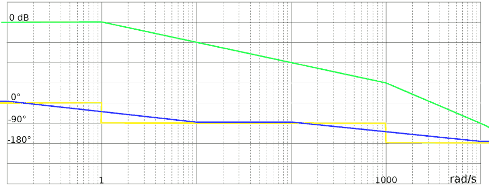
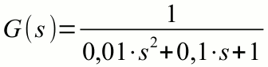
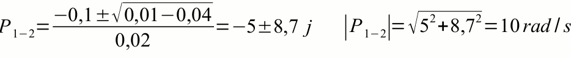
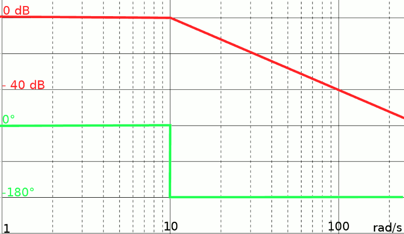

**Bode plots are graphs that describe how the modulus and phase of a transfer function varies as frequency changes.** Asymptotic tracing, i.e. approximated using straight line segments, will be illustrated below with some examples.

Often the bode plot is also indicated with the term frequency response as it represents how the response (i.e. the output) of a circuit changes with the frequency.
The various paragraphs illustrate more and more complex situations and therefore it is advisable to read the page in the proposed order.

The grid to be used is shown on the Logarithmic units:
+	In horizontal the values of s in radians per second (as in the following examples) or Hz, on a logarithmic scale
+	Vertically, the gain module (in dB, usually a division corresponds to 20 dB) or the phase (in °, generally a division corresponds to 90 °)

An asymptotic bode plot consists, in the simplified version described here, exclusively of:
+	Horizontal segments
+	"Uphill" segments inclined by +20 dB / decade, that is parallel to a straight line passing through the vertices of the main divisions of the grid (the solid lines, not the dotted ones)
+	Inclined segments of + 40 dB / decade, 60 dB / decade and integer multiples
+	"Downward" segments inclined by -20 dB / decade and its integer multiples

The slope of +20 dB / decade is often indicated as +1; the slope of -40 dB / decade is indicated as -2; a horizontal segment with slope 0.

The rules for drawing the bode diagram form are as follows:
+	Find poles and zeros, calculate their module and sort them in ascending order
+	The graph starts horizontally from the left (in reality the term "start" is incorrect: the graph extends to the left infinitely). The value can be calculated by setting s = 0. It is also correct to assign another value to s as long as it is much smaller than any zero or pole present
+	We move to the right, until we meet a pole: the slope, from this value of s onwards, decreases by 20 dB/decade (i.e. changes by -1)
+	If a zero is encountered, the slope increases by 20 dB / decade (i.e. +1)
+	If we encounter pairs of coinciding poles or zeros (in jargon: double), the variation in slope doubles
Important note: saying that the slope increases is different from saying that the value increases!
For a (partial) verification of the result we can observe that the "final" slope is equal to the number of zeroes minus the number of poles.

**Let's see an example:**

This transfer function has two zeros and three poles, all negative. Let's calculate them and write them in order, according to the value of their form, from the smallest to the largest:
+	pole for s = -0.1, double (it is squared!)
+	zero for s = -1
+	zero for s = -10
+	pole for s = -50

We calculate the "initial" value in dB, placing s = 0 in the G (s). Alternatively, with the same result, any value of s much smaller than the smaller pole or zero could be used, then approximating the result:

G (0) = 100 = 40 dB

1.	We write the following values on the bode diagram, trying to occupy the central part of the grid:
+	module of the poles, on the abscissa axis
+	modulus of zeros, on the abscissa axis
+	the "initial" value of G (0) calculated above and some values above or below, on the ordinate axis
2.	We draw a horizontal line from the far left of the grid to the value of the modulus of the first pole or zero. This line to the left continues indefinitely. Green on the graph
3.	Arrived at 0.1 rad / s we find a double pole: the slope changes by -2 and goes from 0 to -2 (-40 dB / decade, i.e. in the interval between 0.1 and 1 it decreases by 40 dB). Blue line
4.	At 1 we find a zero. The slope increases by 1 and goes from -2 to -1. Fuchsia section
5.	At 10 we find another zero. The slope increases by 1 and goes from -1 to 0. Yellow line
6.	At 50 we find the last pole. The slope changes -1 and changes from 0 to -1. Orange line. This stretch continues indefinitely without changes in slope

Note that the fuchsia and orange lines are parallel to each other, which is obvious by observing that both have a slope of -20 dB / decade.  Note also that the final slope could be easily predicted by observing that we are in the presence of 3 poles and two zeros (2 - 3 = -1)

**Case 1bis - Real poles and zeroes, less than zero - "stepped" phase**

The rules for drawing the phase diagram are as follows:
-	Once you have found poles and zeros, you need to calculate their form and order them in increasing order. It is the same passage of the previous point
-	The chart starts horizontally to the left of the chart. The initial value is zero
-	If a pole is encountered, the phase decreases "stepwise" by 90 °. This rule is very rough!
-	If a zero is encountered, the phase increases by 90 °. This rule is very rough!
Important note: saying that the phase increases is different from saying that the slope increases!

Let's apply these rules to the same example above:

**Case 2 - Poles or zeroes in the origin**

A pole (or a zero) is said in the origin if it has a value of zero.
The procedure is similar to the previous ones with the following additions:
-	If there is a pole in the origin, the module graph "starts" already skewed by -1
-	If there is a zero in the origin, the form graph "starts" already skewed by +1
-	If there is a pole in the origin, the phase graph "starts" from -90 °
-	If there is a zero in the origin, the graph of the phase "starts" from + 90 °
-	If there are two or more poles or zeros in the origin, the initial slope of the module graph is ± 2, ± 3 etc.
-	If there are two or more poles or zeroes in the origin, the initial phase is ± 180 ° and multiples of 90 °

Let's see an example:

This transfer function has one zero and two poles. Let's calculate and write them by ordering them according to their module, from the smallest to the largest in module:
+	pole for s = 0 (in the origin)
+	zero for s = -0.1
+	pole for s = -1

As always in these cases, we cannot calculate G (0) as it results in an indeterminate form (∞). So let's calculate, for example, the G (s) for a value of s equal to 0.001, much smaller than 0.1:

G(0,001) = 100 = 40 dB

1.	We write the following values on the bode diagram, trying to occupy the central part of the grid:
+	pole module other than 0
+	modulus of zero
+	s value used in the above formula
+	gain value a match of the s value chosen above
2.	We have a pole in the origin: the graph starts already tilted by -1. This straight line must pass through the point (0.001; 40), calculated above. To the left, outside the graph, the graph continues to rise. In green
3.	At 0.1 we find a zero, the slope changes from -1 to 0. In blue
4.	At 1 we find a pole, the slope becomes -1. In yellow
5.	The phase starts from -90 °; at 0.1 it changes to 0 °; at 1 it definitely returns to -90 °. In orange, drawn on the same graph as the form, as you generally prefer to do

**Let's better approximate the phase**

As mentioned, the "stepped" design of the phase has very low precision.
To better approximate the graph we can add the following rule:
-	Given a pole (or a zero) locate the point of the step chart a decade before and a decade after
-	Join these points with a segment

Let's see a first example, with two rather distant poles between them.

In addition to the form (in green) there is a graph of the "stepped" phase (in yellow) and the best approximated one (in blue).

**Remarks:**

+	The phase graph continues horizontally to the left
+	The phase graph continues horizontally to the right
+	In areas very far from the poles (or zeros) the two graphs of the phase coincide: in the example between 10 and 100 rad / s or for values lower than 0.1 rad / s
+	At the poles (or zeros) the two graphs of the phase coincide. At these points the phase is exactly 45 ° or 135 ° (90 ° + 45 °)

**Positive poles and zeros**

It should be noted in advance that this case never occurs in systems made up of only RLC components. Instead, they may be present in more complex feedback systems.
As for the module graph, nothing changes compared to what has already been said.

As for the phase, the behavior is exactly the opposite of what is described:
+	A positive pole increases the phase by + 90 °
+	A positive zero changes the phase by -90 °

**Complex poles and zeros**

The solutions of an equation of degree n are always present n roots, some real and others complex and conjugated, that is, pairs of solutions with coincident real part and imaginary part changed sign.
If we consider only the asymptotic graphs, nothing changes compared to what has already been described, having the only warning to consider the modulus of poles and zeros. As for the phase, the sign to consider is that of the real (usually negative) part. Obviously these poles and zeros are always double.

Let's see an example:

We find the two poles. The determinant is negative and therefore an imaginary part is present.

The asymptotic diagram of bode, module and phase, is therefore the following:

