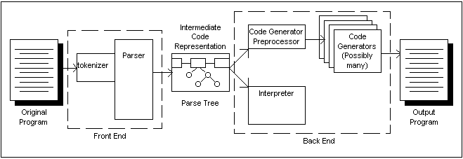

  

A compiler is a tool that translates a program from one language to another language. An interpreter is a tool that takes a program and executes it. In the first case the program often comes from a file on disk and in the second the program is sometimes stored in a RAM buffer, so that changes can be made quickly and easily through an integrated editor. This is often the case in BASIC interpreters and calculator programs. We will refer to the source of the program, whether it is on disk or in RAM, as the input stream.  

Regardless of where the program comes from it must first pass through a Tokenizer, or as it is sometimes called, a Lexer. The tokenizer is responsible for dividing the input stream into individual tokens, identifying the token type, and passing tokens one at a time to the next stage of the compiler.  

The next stage of the compiler is called the Parser. This part of the compiler has an understanding of the language's grammar. It is responsible for identifying syntax errors and for translating an error free program into internal data structures that can be interpreted or written out in another language.  

The data structure is called a Parse Tree, or sometimes an Intermediate Code Representation. The parse tree is a language independent structure, which gives a great deal of flexibility to the code generator. The lexer and parser together are often referred to as the compiler's front end. The rest of the compiler is called the back end. Due to the language independent nature of the parse tree, it is easy, once the front end is in place, to replace the back end with a code generator for a different high level language, or a different machine language, or replacing the code generator all together with an interpreter. This approach allows a compiler to be easily ported to another type of computer, or for a single compiler to produce code for a number of different computers (cross compilation).  

Sometimes, especially on smaller systems, the intermediate representation is written to disk. This allows the front end to be unloaded from RAM, and RAM is not needed for the intermediate representation. This has two disadvantages: it is slower, and it requires that the parse tree be translated to a form that can be stored on disk.  

The next step in the process is to send the parse tree to either an interpreter, where it is executed, or to a code generator preprocessor. Not all compilers have a code generator preprocessor. The preprocessor has two jobs. The first is to break any expressions into their simplest components. For example, the assignment a := 1 + 2 * 3 would be broken into temp := 2 * 3; a := 1 + temp; Such expressions are called Binary Expressions. Such expressions are necessary for generating assembler language code. Compilers that translate from one high level language to another often do not contain this step. Another task of the code generator preprocessor is to perform certain machine independent optimizations.  

After preprocessing, the parse tree is sent to the code generator, which creates a new file in the target language. Sometimes the newly created file is then post processed to add machine dependent optimizations.  

Interpreters are sometimes called virtual machines. This stems from the idea that a CPU is actually a low level interpreter - it interprets machine code. An interpreter is a high level simulation of a CPU.  