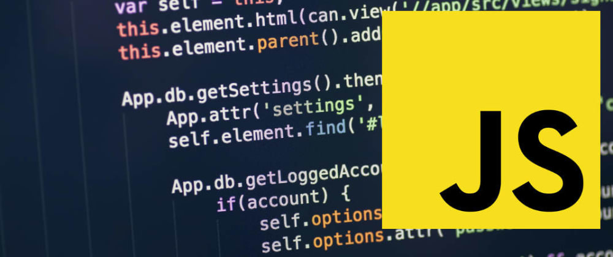

 

**How to hide all elements specified?**    
´´´
const hide = (...el) => [...el].forEach(e => (e.style.display = 'none'));

// Example
hide(document.querySelectorAll('img')); // Hides all  elements on the page
´´´

**How to check if the element has the specified class?**    
´´´
const hasClass = (el, className) => el.classList.contains(className);

// Example
hasClass(document.querySelector('p.special'), 'special'); // true
´´´

**How to toggle a class for an element?**    
´´´
const toggleClass = (el, className) => el.classList.toggle(className);

// Example
toggleClass(document.querySelector('p.special'), 'special'); 
// The paragraph will not have the 'special' class anymore
´´´

**How to smooth-scroll to the top of the page?**    
´´´
const scrollToTop = () => {
  const c = document.documentElement.scrollTop || document.body.scrollTop;
  if (c > 0) {
    window.requestAnimationFrame(scrollToTop);
    window.scrollTo(0, c - c / 8);
  }
};

// Example
scrollToTop();
´´´

**How to check if the parent element contains the child element?**    
´´´
const elementContains = (parent, child) => parent !== child && parent.contains(child);

// Examples
elementContains(document.querySelector('head'), document.querySelector('title')); 
// true
elementContains(document.querySelector('body'), document.querySelector('body')); // false
´´´

**How to fetch all images within an element?**    
´´´
const getImages = (el, includeDuplicates = false) => {
  const images = [...el.getElementsByTagName('img')].map(img => img.getAttribute('src'));
  return includeDuplicates ? images : [...new Set(images)];
};

// Examples
getImages(document, true); // ['image1.jpg', 'image2.png', 'image1.png', '...']
getImages(document, false); // ['image1.jpg', 'image2.png', '...']
´´´

**How to figure out if the device is a mobile device or a desktop/laptop?**    
´´´
const detectDeviceType = () =>
  /Android|webOS|iPhone|iPad|iPod|BlackBerry|IEMobile|Opera Mini/i.test(navigator.userAgent)
    ? 'Mobile'
    : 'Desktop';

// Example
detectDeviceType(); // "Mobile" or "Desktop"
´´´

**How to get the current URL?**    
´´´
const currentURL = () => window.location.href;

// Example
currentURL(); // 'https://google.com'
´´´

**How to remove an event listener from an element?**    
´´´
const off = (el, evt, fn, opts = false) => el.removeEventListener(evt, fn, opts);

const fn = () => console.log('!');
document.body.addEventListener('click', fn);
off(document.body, 'click', fn); // no longer logs '!' upon clicking on the page
´´´

