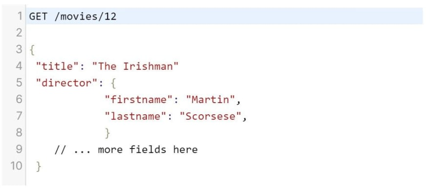
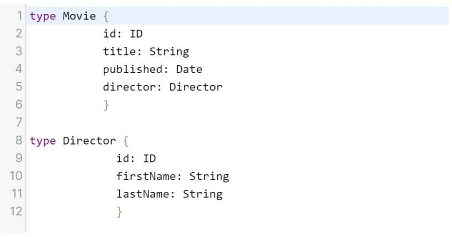
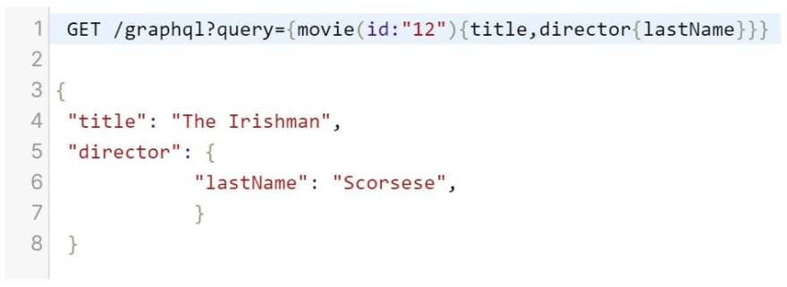

 

It's the year 2000 and computer scientist Roy Fielding earned his Ph.D. with a dissertation that proposed a new software architectural style: Representational State Transfer. REST, for short.  

RESTful APIs allowed web clients to access resources through a predefined set of stateless operations. Because requests made to a resource's URI could be sent back in JSON, REST was a simpler solution than SOAP, the dominant protocol at the time, where requests would be sent back in difficult-to-parse XML.  

RESTful APIs quickly became the de-facto standard for web APIs. It's only in the last few years that a credible competitor has emerged. Since 2012, Facebook has been using a new query language to build its mobile apps: GraphQL. The language was open-sourced in 2015 and it's been growing in popularity ever since.  

This article will address the main differences between REST and GraphQL. As you'll see, GraphQL has some distinct advantages over REST, although which API you need will ultimately depend on the specific app you're building.  

Additionally, the advantages of GraphQL described in this article are mostly over "so-called REST" APIs, as Zdenek Nemec calls them in this blog post. There's a lot to REST and the HTTP protocol. Given enough time and knowledge, you can create a REST API that's just as good as and arguable more flexible than a GraphQL API.  

This being said, given that developers are busy enough as is and true REST APIs are incredibly hard to pull off (as Nemec says himself in his blog post), we'll be talking about REST APIs as most are configured today.  

**Many Endpoints vs One Endpoint**  
A REST API has multiple endpoints (which can also be called paths). This means that it exposes multiple URIs that react to different HTTP methods. The developers define which paths are open to the client. The most common HTTP methods for a REST API are GET, POST, PUT, PATCH, and DELETE.  

For example, POST /user {name: 'Thomas'} is a request to one path. It consists of the HTTP verb POST, the path /user, and the request body {name: 'Thomas'} (which is optional, depending on the HTTP verb).  

A GraphQL API, however, only has one endpoint, usually /graphql. All GraphQL requests for a given resource should be directed to this endpoint. Additionally, a GraphQL API only takes one HTTP methods: POST (there's an option to enable GET queries). Here's an example of a GraphQL POST request query: /graphql?query={user{name}}.  

query is the operation type, user is the operation endpoint, and name is the requested field that you'd like to get back. The request body is necessary here, and allows you to be quite specific in what you'd like to get back, which brings us to the second big difference between REST and GraphQL.  

**Over- and Underfetching vs Getting What You Ask For**
REST APIs are prone to both over- and underfetching. Overfetching, because a REST API will send back all the data in a single endpoint, regardless of whether you want it all. In the below example, you will receive all the fields that are associated with the /movies/12 endpoint:  

With GraphQL, however, you can build the schema so that clients can be much more specific. This is how you could build a GraphQL schema for the above example:  

And here's how you can ask for data and what the results would look like with GraphQL:  

As you can see, you get back exactly what you want. There's no overfetching, because the client specifies exactly what it wants in the request body of the query.

A REST API tends to underfetch too, because it often needs to take multiple roundtrips for related resources. For example, looking up information about a blog post and its author might need two HTTP GET requests through a REST API, because there are two endpoints: /posts/1 and /users/1.

With GraphQL, you can ask for that information in a single request. The downside of this preciseness is that GraphQL adds an extra layer of complexity, because developers have to manage the schema types and queries in the front-end.