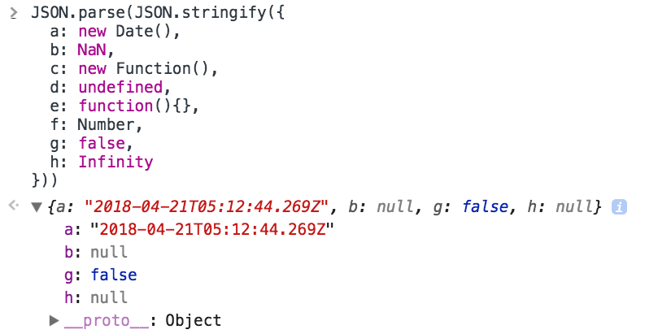
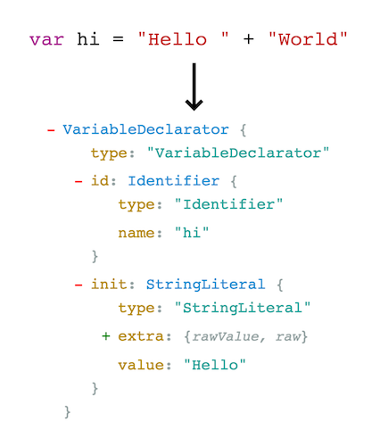

  
**Serialization** is the process of converting a data structure into a format that it can be safely stored or transmitted and the recreated from the stored or transmitted format. It's usually used to refer to applying this process to complex data structures like trees, objects, or graphs, as they don't inherently lend themselves to being transmitted as a simple string of binary data. Converting an in-memory object to JSON or XML is an example of serialization. 

  
**Parsing**, on the other hand, takes a stream of (structured) data and then does something based on the contents of that stream, usually either creating an in-memory structure based on it, or executing a sequence of operations based on it.  

**Deserialization** (the reverse process of serialization) is a particular type of parsing, it takes serialized data and recreates the original data structure from it. However, you can do many other types of parsing. Compiling source code is also a type of parsing (together with serialization), as is linting or formatting code, doing static analysis of it, and many other things you would do to it using tools. So is decompressing a compressed file or listing the contents of an archive.

